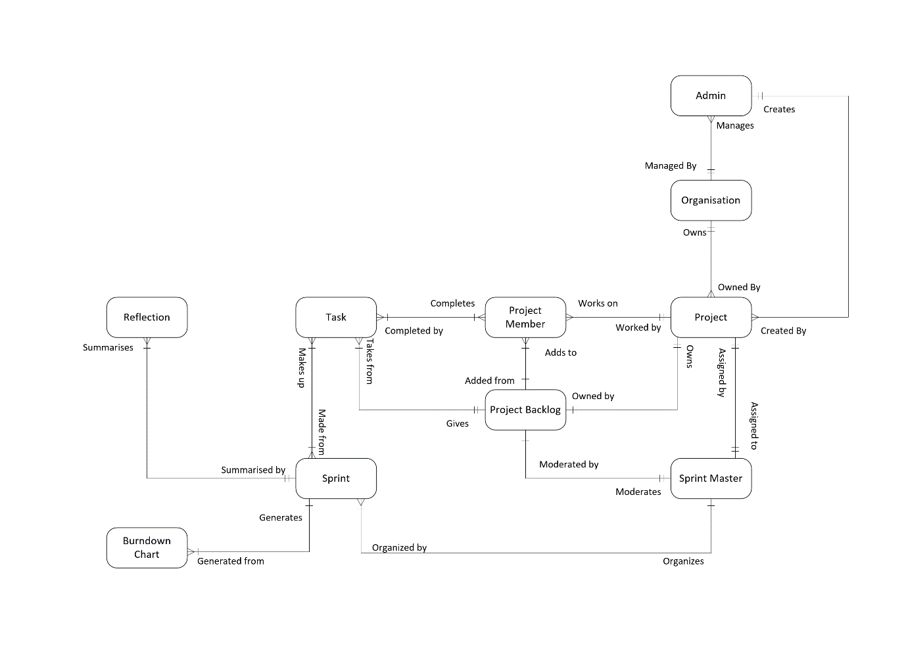
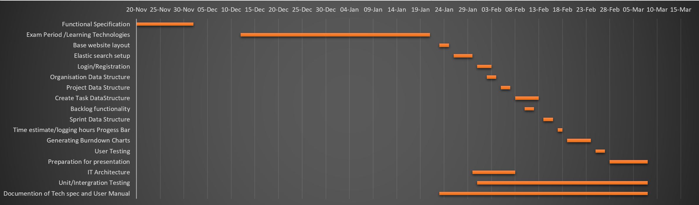

1 Introduction
==============

**1.1 Overview:**
-----------------

The system is a web based application that allows management of an agile
development driven project with an emphasis on keeping it lightweight and
bloat-free. The system will be hosted by the organisation using the software.
The agile task tracker system will allow project managers within an organisation
to create new projects in the organisation, and add assorted organisation
members to said projects.

A project will consist of a task backlog, sprints and the project members
associated with that project. A sprint is a variable amount of time, set by the
Sprint Master in which certain tasks from the backlog are to be worked on. The
Sprint Master decides on which tasks are to be worked on in that particular
Sprint.

The main objective of the system is to provide all associated project members
and management to be able to review the current progress of a sprint at a
glance, showing all the relevant data pertinent to that sprint.

At the end of a sprint the system will let the Sprint Master create a reflection
for the sprint. This will let all of the project members judge how well they are
working, and highlight areas in which they need to improve upon.

Another feature of the system will be the ability to produce burndown charts to
get an idea of the progress of the project vs the man hours specified for it.
This can be done on a sprint by sprint basis, or the project as a whole.

**1.2 Business Context:**
-------------------------

The system will be able to be deployed in any agile development driven
environment. It will be suitable to be used by both businesses and Universities.
As each project will be self-contained in terms of sprints, tasks and project
members, it can be scaled to the required level.

It can be used by both professional software development teams and DCU students
working on their 3rd and 4th year projects, particularly those in the school of
computing.

**1.3 Glossary** 
-----------------

**Business Terms:**

-   **Tasks**

>   A task is some work item that needs to be completed to further along the
>   progress of the project

-   **Task Backlog**

>   A collection of tasks to be completed for a particular project.

-   **Epic**

>A large task/feature that has to be broken up into smaller tasks to aid
completion in an Agile environment

-   **Sprints**

>The time period in which tasks are to be assigned to and completed. Highly
regulated.

-   **Sprint Master**

>A team leader in the non-traditional sense who is responsible for removing

>impediments that will prevent developers from completing their tasks. In charge
of managing sprints in terms of tasks assigned to that particular sprint.

-   **Reflections**

>Reflections are a look back generally done on completion of a sprint that
identifies approaches that should be continued, ones that should be dropped and ones that need to be adopted for future sprints.

-   **Burndown Chart**

>This chart visually shows how much work is left to do vs the time to do it.

**Tech terms**:

-   **ClojureScript**

>   ClojureScript is the web version of Clojure, which is a Lisp based
>   functional language that runs on the Java Virtual Machine. ClojureScript
>   produces code that compiles to JavaScript, giving you both the programming
>   power of Clojure combined with the widespread compatibility and reach of
>   JavaScript.

-   **Select2**

>   Select2 is a Jquery library that provides customisable replacements to
>   various input fields such as input boxes and dropdown menus

-   **Bootstrap**

>   This is a frontend framework used to help make web-pages responsive and
>   scalable across multiple kinds of devices.

-   **Buddy**

>   This is a security library for Clojure that is used for the authentication
>   and authorization of web-applications

-   **ElasticSearch**

>ElasticSearch is a Lucene based datastore and datasearch engine.

-   **Kibana/Grafana/D3.js**

>These are a variety of libraries used for the generation of graphs.

2. General Description
======================

**2.1 Product / System Functions**
----------------------------------

The below describes the main functionality of our system. This list is
provisional and is open for expansion/alteration based on feedback we receive
from our project supervisor.

-   Register Account / Log Into Existing Account

-   Create Organisation

-   Add members to Organisation

-   View Project

-   Create Project

-   View Project Backlog

-   Create Tasks in backlog

-   Create Sprint

    -   Set Sprint Start and End Date

    -   Assign Sprint Man Hours

-   Assign Tasks from Backlog to Sprint

-   Assign Members/Sprint Master to Project

-   Update Task Status

-   Assign self to task

-   Edit task description

-   Estimate time for task

-   Log hours for task

-   Remove Task from Sprint to Backlog

-   Complete Sprint

    -   Create Sprint Reflection

-   Generate Burndown Chart

-   Edit Project

-   Close Project

All the above requires a valid login, excluding the registration of an account.

**2.2 User Characteristics and Objectives**
-------------------------------------------

As stated previously we have two primary target audiences in mind, business
mainly focused on Software Development and University Computing modules.
However, our system will be open to use by any group working on a project using
an agile methodology.

The application should be simple to use, regardless of the user’s experience in
Agile development or using project management software.

**2.3 Operational Scenarios**
-----------------------------

-   **Unregistered/Logged Out User**

In order to use our system, the user must be signed in

-   Register an account

-   Log into an account

-   **Project member**

A project member is just a user that has been assigned to a project by the
Sprint

Master. They then inherit the following functions relating to the project they
are

currently working on.

-   View Projects they have been assigned to

-   Update Task Status ie. To Do, In Progress, Completed.

-   Assign self to task

-   Edit task description

-   Estimate time for task

-   Log hours for task

-   Add/Delete task to/from Backlog

-   Generate Burndown Chart

-   **Sprint Master**

>   A Sprint Master is in charge of managing the Sprints of a project. The have
>   the same permissions as a project member in addition to the following:

-   Add a user in the organisation to the project

-   Create Sprint

    -   Set Sprint Start and End Date

    -   Assign Sprint Man Hours

-   Add/Delete Task to/from Sprint

-   Complete Sprint

    -   Create Sprint Reflection

-   **Admin**

>   The Administrator has the highest Permissions Level within an organisation.
>   They have the same permissions as a Sprint Master in addition to the
>   following:

-   Create an Organisation

-   Create/Add member accounts to the Organisation

-   View All Projects

-   Create a Project

-   Assign Members/Sprint Masters to Project

-   Close a Project

**2.4 Constraints**
-------------------

**Database/Server usage**

As we have mentioned above, we plan for organisation that is using our system to
host the servers. As such, the memory available both to the server and database
will be constrained by the resources available to the organisation itself.

**Time**

We will be developing the system under a relatively tight time frame. We must
take into consideration the time that will have to be spent learning the
relevant technologies used in the development of the system. As such we aim to
have the base functionality of the system ready for demonstration and will be
prioritizing them over additional features.

3. Functional Requirements
==========================

**3.1 Register Account / Log into Existing Account**
----------------------------------------------------

-   **Description:**

In order to use the system, the user must be logged into an account. They will
be

given the option to register a new account or to log into an existing one.

-   **Criticality:**

>   As each user must have an account, it is critical that we have account
>   creation and sign in working.

-   **Technical issues:**

>   The main issue we will face here is making sure that the login is secure. We
>   plan to use clojure security libraries such as Buddy to hash the user
>   information so we won’t be sending plaintext passwords between the client
>   and server over an unsecure connection.

-   **Dependencies:**

>None, this this is the first step a user must make to use our system.

**3.2 Create Organisation**
---------------------------

-   **Description:**

>After registering and logging in the user will be given the option of creating
an organisation as an Admin. They will be able to then add members and projects
to tied to this organisation.

-   **Criticality:**

>To provide a necessary division/organisation to projects, for example each
module in DCU could be given its own branch/organisation.

-   **Technical issues:**

>   We will have to provide the user a small form that is both easy to interact
>   with and non-tedious to fill out. We will use the Select2 library to for our
>   input fields, which is more customisable and scales better across multiple
>   devices and screen sizes. This information must then be stored in our
>   database.

-   **Dependencies:**

> This action can only be performed by a logged in user.

**3.3 Add members to Organisation**
-----------------------------------

-   **Description:**

>After the creation of an organisation, the admin can start adding users to that
organisation so they can then be placed on projects relating to that
organisation.

-   **Criticality:**

>As no one can be assigned to a project without being a member of that
organisation,
this function will be critical.

-   **Technical issues:**

>   On our database, Elasticsearch, we will have to associate this user as a
>   member of the specified organisation.

-   **Dependencies:**

>   Before members can be added to the organisation, the organisation must
>   exist. An Admin who is logged in will add members to the organisation.
>   However the user being added to the organisation does not need to have an
>   account, as the admin has the ability to create the account for the user.

**3.4 View Projects**
---------------------

-   **Description:**

>   Every user can view the projects they have been assigned to. Admins can view
>   all of the projects made within the organisation.

-   **Criticality:**

>   Being able to see the project that a user is working on is obviously a high
>   priority. However, restricting users from not being able to view projects
>   they are not assigned to is of a medium priority.

-   **Technical issues:**

>   This will involve making a get request to the database for the information
>   pertaining to the projects of the organisation. We must also check what type
>   of user is generating a request. If they are an admin, we can display all
>   projects in the organisation, otherwise we must filter the results to only
>   the projects the user is associated with.

-   **Dependencies:**

>   In addition to being logged in and the user being a part of an organisation,
>   this feature will also partially depend on the creation of projects
>   **(3.5)**. If no projects are created, the View Projects function will
>   display a page stating that no projects are available, which is a valid
>   scenario.

**3.5 Create Project**
----------------------

-   **Description:**

>As an Admin you can add a project to an organisation and set a proposed
deadline.

-   **Criticality:**

>Pretty vital, as you cannot set tasks or assign people to tasks without a
project etc.

-   **Technical issues:**

>   This will face the same issues outlined in the creation of an organisation
>   **(3.2)**. A form made up of Select2 elements will be filled out by an
>   Admin, which will then be stored in the database.

-   **Dependencies:**

>   A project can only be made within an organisation, and can only be made by
>   an Admin.

**3.6 View Project Backlog**
----------------------------

-   **Description:**

>Anyone assigned to the project can view the project backlog to see what tasks
are to be completed.

-   **Criticality:**

>For project members this would be noncritical, however for admins and Sprint
Master would be critical as they need to see the tasks that can possibly be assigned to
a sprint

-   **Technical issues:**

>   A get request must be made to the database requesting the tasks that are not
>   only associated with the project, but those which are marked as being a part
>   of the backlog. This information must then be displayed on the frontend of
>   the system.

-   **Dependencies:**

> This depends on a project being created.

**3.7 Create/Delete Tasks in backlog**
--------------------------------------

-   **Description:**

>   All tasks are created here in the backlog. Later on they will be added from
>   here to a Sprint by a Sprint Master. If a task is deemed no longer
>   necessary, it can be removed.

-   **Criticality:**

>   As the entire system revolves around tasks being tracked and completed, the
>   ability to make the tasks is vital, as is the removal of unnecessary.

-   **Technical issues:**

>   For the creation of tasks input forms need to be filled out for the
>   different fields of the task, with validation being carried out ensuring all
>   of the required fields are filled. The newly created task must then be
>   displayed on the frontend and stored on the database with a put request.

>   For the deletion of the task it must no longer be displayed on the frontend
>   and must be removed from the database.

-   **Dependencies:**

>   This requires the user creating/deleting the task to be logged in and to be
>   a member of the project for the backlog they are adding/removing to. The
>   user must also be able to view the project backlog in order to interact with
>   it.

**3.8 Create Sprint**
---------------------

-   **Description:**

>A Sprint Master may create a new sprint, assigning the start and end date of it,
the

>   man hours being assigned to it and choose tasks from the project backlog to
>   be added to the sprint.

-   **Criticality:**

>As the application is based on Agile on methodology the creation and usage of
>Sprints is vital. Without a sprint a task cannot be assigned from the backlog.

-   **Technical issues:**

>   We must restrict the ability to create a sprint to a user with the
>   privileges of a Sprint Master. We must ensure that at least 1 task is
>   assigned to the Sprint before it is started. In addition to Select2 input
>   fields, we will also use the Bootstrap DateTimePicker for selecting the
>   start and end times of the sprint.

-   **Dependencies:**

>   This depends on the creation of a Project, as a sprints are made for a
>   particular project.

**3.9 Assign Tasks from Backlog to Sprint**
-------------------------------------------

-   **Description:**

>   Tasks from the backlog are added to the active sprint by the Sprint Master.
>   Only Sprint Masters can add tasks to the Sprint to preserve the Agile
>   philosophy of a sprint, i.e. a sprint is an uninterrupted work cycle with no
>   new features being shoehorned in halfway through a sprint, only tasks
>   relevant to the current work in a sprint being added.

-   **Criticality:**

>   Logically a task can only be worked on if it is part of the current sprint,
>   thus making this an important function.

-   **Technical issues:**

>   This function must be restricted to only Sprint Masters. We must then change
>   the association of the task in the database to be associated with the sprint
>   rather than the backlog.

-   **Dependencies:**

>   This depends on a project being created, a sprint being created, and a
>   Sprint Master being assigned to the Project **(3.10)**

**3.10 Assign Members/Sprint Master to Project**
------------------------------------------------

-   **Description:**

>After a project has been created, an Admin can associate project members
> and Sprint masters to a project.

-   **Criticality:**

> Without assigning anyone to the project, no tasks can be completed.

-   **Technical issues:**

> On the database we must associate the user being assigned with the Project.

-   **Dependencies:**

> This requires a project being created and users being added to the organisation.

**3.11 Update Task Status**
---------------------------

-   **Description:**

>   Within a sprint a task can have one of three statuses; To Do, In Progress,
>   and Completed. This can be achieved through click and dragging the task from
>   one column in the sprint to the relevant column.

-   **Criticality:**

>   As both this feature and the logging of hours for a task **(3.15)**, are
>   used for the tracking of the progress of a task, it is a critical feature.

-   **Technical issues:**

> Look into accessibility options for this feature.

-   **Dependencies:**

>   This depends on the creation of a sprint and the adding of a task from the
>   backlog to a sprint.

**3.12 Assign self to task** 
-----------------------------

-   **Description:**

>   Once a user has been assigned as a project member of a project and the
>   current sprint has tasks allocated to the “To Do” column, they can assign
>   themselves to a task. A user can then log hours worked upon the task.

-   **Criticality:**

>For accountability and transparency, it is vital that a user can assign
themselves to a task. Having people take responsibility.

-   **Technical issues:**

>   We will need some contextual button that will detect which user has pressed
>   it, and then add that user to the list of users assigned to the task. The
>   list of users assigned to the task must also be updated in the database.

-   **Dependencies:**

>   This depends on tasks being assigned to a sprint from the backlog **(3.9)**,
>   as a user can only assign themselves to tasks in an active sprint.

**3.13 Edit task description** 
-------------------------------

-   **Description:**

>   This optional feature lets a user add a description for the task, to help
>   clarify what needs to be done for the task.

-   **Criticality:**

> As this feature is optional it has a low priority.

-   **Technical issues:**

>   This will involve using a Select2 input box to edit the description
>   associated with the task.

-   **Dependencies:**

> This depends on a task being made in the backlog.

**3.14 Estimate time for task**

-   **Description:**

>   A task upon creation may not have a time estimated, but one must be added
>   before it can be moved into a current sprint. This estimate will be
>   represented visually as a progress bar on the task comparing logged hours’
>   vs estimated hours.

-   **Criticality:**

>   While the task is in the backlog the ability to make an estimate is
>   optional, but to add the task to a sprint it is mandatory, to it has a high
>   priority.

-   **Technical issues:**

>   We will have to make a Bootstrap Progress bar comparing logged hours’ vs
>   estimated hours.

-   **Dependencies:**

>   This will depend on the creation of a task, as a time estimate may be made
>   either during the estimate of the task, or after it has been made and is in
>   the backlog.

**3.15 Log hours for task**
---------------------------

-   **Description:**

>   Users who are assigned to a task should log the hours they work on a task.
>   This information will be used in both the task’s progress bar comparing
>   logged hours’ vs estimated time, and the generation of Burndown Charts.

-   **Criticality:**

>   As the logging of hours spent on a task will be used in conjunction with
>   updating a task’s status **(3.11)** to track the progress of a task, and to
>   generate progress bars and burndown charts, it is of a high importance that
>   this feature is working correctly.

-   **Technical issues:**

>   As the user logs their hours spent on a task, again through a Select2 input
>   field, we will have to update the total sum of hours logged both for that
>   user and for that task on the database. Also this information will have to
>   be given to the Bootstrap Progress Bar mentioned in **(3.14)**.

-   **Dependencies:**

>   This will depend on a task being created, the task being added to a sprint,
>   and the user being added as a project member.

**3.16 Remove Task from Sprint to Backlog**
-------------------------------------------

-   **Description:**

>If a task is accidentally added from the backlog to the current sprint, the
Sprint Master has the ability to remove the task.

-   **Criticality:**

> For upkeep of the current sprint this task is of high importance.

-   **Technical issues:**

>   The database must be updated so that the task is no longer associated with
>   the current sprint, and instead is re-associated with the project backlog.
>   We must ensure that only users with the privilege level of a Sprint Master
>   can perform this action.

-   **Dependencies:**

> This will depend on a task first being added to a sprint.

 **3.17 Complete Sprint**
-------------------------

-   **Description:**

>   A sprint will automatically be completed when it reaches the sprint end date
>   and time, which closes it off from having more tasks assigned to it, or
>   people logging hours for tasks associated with it. Any uncompleted tasks
>   will be carried over into the next sprint time period. Upon completion of a
>   sprint, a reflection may be created.

-   **Criticality:**

>   The active sprint must be completed before another may begin, making this
>   function critical to the flow of the project.

-   **Technical issues:**

>   We must compare the current date and time with the Sprint end date and time,
>   avoiding at all cost any busy waiting issues.

-   **Dependencies:**

>   This will depend on an end date and time being set during the creation of
>   the sprint. **(3.8)**

**3.18 Generate Burndown Chart**
--------------------------------

-   **Description:**

> A burndown chart can be generated at any time by any project member so that they
can visually see the progress of a sprint or the project as a whole.

-   **Criticality:**

>   This is of medium importance, as while useful for checking the progress of
>   the project, it is not giving new information that couldn’t be gathered by
>   manually looking at the sprints.

-   **Technical issues:**

>This will require the use of data graphing libraries such as Kibana, Grafana or
D3.js.

-   **Dependencies:**

>   This depends on the logging of hours to a task **(3.15),** estimating the
>   time of a task **(3.14)** and the updating of a task status **(3.11)**.

**3.19 Edit Project**
---------------------

-   **Description:**

>In the scenario that a project description or deadline needs to be adjusted an
Admin use this function to update the particular variables.

-   **Criticality:**

> High for base functionality.

-   **Technical issues:**

>   All changes must be written to the database. Also we will need to add
>   validation to ensure that the end date isn’t changed to a date before a
>   sprint starts or ends.

-   **Dependencies:**

> This depends on the creation of a project **(3.5)**

**3.20 Close Project**
----------------------

-   **Description:**

>Upon a project reaching its deadline/being completed an Admin can then close it
off. No more sprints and by extension, tasks, may be added to it.

-   **Criticality:**

> Base Functionality.

-   **Technical issues:**

>   The project must be marked as closed on the database. The ability to create
>   or edit sprints and tasks must be disabled once a project is closed.

-   **Dependencies:**

> This depends on the creation of a project **(3.5)**

4. System Architecture
======================

**4.1 Agile Task Tracker Interface**

This is the frontend website that the user will see on their internet browser.
This will be written in ClojureScript, and will be how the user interacts with
the system.

**4.2 JavaScript Libraries**

These are 3rd party libraries that will be used in the frontend website.
Examples of JavaScript libraries that will be used are:

-   BootStrap,

-   Select2

-   Jquery

**4.3 Graphing Library**

This includes libraries we are considering to use in the generation of Burndown
Charts. Examples of libraries that we are exploring are:

-   Grafana

-   Kibana

-   D3.js

**4.4 Elasticsearch Database**

This is the database where we will be storing all of the information of the
System. Data will be both stored to and fetched from the database via the
frontend website.

5. High-Level Design
====================

Logical Data Model
------------------

----------------------------------------

Activity Model
--------------

6. Preliminary Schedule
=======================

| **Tasks**      |              |                                            |                    |
|----------------|--------------|--------------------------------------------|--------------------|
| **Start Date** | **End Date** | **Description**                            | **Duration(days)** |
| 20-Nov         | 02-Dec       | Functional Specification                   | 12                 |
| 12-Dec         | 21-Jan       | Exam Period /Learning Technologies         | 40                 |
| 23-Jan         | 25-Jan       | Base website layout                        | 2                  |
| 26-Jan         | 30-Jan       | Elastic search setup                       | 4                  |
| 31-Jan         | 03-Feb       | Login/Registration                         | 3                  |
| 02-Feb         | 04-Feb       | Organisation Data Structure                | 2                  |
| 05-Feb         | 07-Feb       | Project Data Structure                     | 2                  |
| 08-Feb         | 13-Feb       | Create Task Data Structure                 | 5                  |
| 10-Feb         | 12-Feb       | Backlog functionality                      | 2                  |
| 14-Feb         | 16-Feb       | Sprint Data Structure                      | 2                  |
| 17-Feb         | 18-Feb       | Time estimate/logging hours Progress Bar   | 1                  |
| 19-Feb         | 24-Feb       | Generating Burndown Charts                 | 5                  |
| 25-Feb         | 27-Feb       | User Testing                               | 2                  |
| 28-Feb         | 08-Mar       | Preparation for presentation               | 8                  |
| 30-Jan         | 08-Feb       | IT Architecture                            | 9                  |
| 31-Jan         | 08-Mar       | Unit/Integration Testing                   | 36                 |
| 23-Jan         | 08-Mar       | Documentation of Tech spec and User Manual | 44                 |

7. Appendices
=============

-   Clojurescript: <http://clojurescript.org/>

-   Select2: <https://select2.github.io/>

-   Bootstrap: <http://getbootstrap.com/>

-   Buddy: <https://funcool.github.io/buddy-auth/latest/>

-   Elasticsearch: <https://www.elastic.co/products/elasticsearch>

-   Kibana: <https://www.elastic.co/products/kibana>

-   Grafana: <http://grafana.org/>

-   D3.js: https://d3js.org/
