>   CA326 Third Year Project

>   Bernard O’Connor Shaun Kinsella

Use Case Testing
================

| **Reference Number (with image)** | **Scenario**                                                                                                                                                             | **Result**                                                                                                                                                                                                                                                          | **Developer Comments / Proposed Solution**                                                                                                    |   |
|-----------------------------------|--------------------------------------------------------------------------------------------------------------------------------------------------------------------------|---------------------------------------------------------------------------------------------------------------------------------------------------------------------------------------------------------------------------------------------------------------------|-----------------------------------------------------------------------------------------------------------------------------------------------|---|
|                                   |                                                                                                                                                                          | **Dashboard Page**                                                                                                                                                                                                                                                  |                                                                                                                                               |   |
| \#001                             | Fig wheel Server Started without Elasticsearch running, user tries to connect to website.                                                                                | java.net.connectException at / connection refused. See image \#001                                                                                                                                                                                                  | As Intended. For Dev only                                                                                                                     |   |
| \#001Uber                         | Uberjar Server Started without Elasticsearch running, user tries to connect to website.                                                                                  | Http 500 error Problem accessing. See image \#001Uber                                                                                                                                                                                                               | As Intended                                                                                                                                   |   |
| \#002                             | When creating an organisation, user only fills out the organisation name                                                                                                 | No organisation is created on the database and the user is shown an alert informing them to fill out all the required details                                                                                                                                       | Works as intended                                                                                                                             |   |
| \#002                             | When creating an organisation, user only fills out the organisation ID                                                                                                   | No organisation is created on the database and the user is shown an alert informing them to fill out all the required details                                                                                                                                       | Works as intended, ID generation                                                                                                              |   |
| \#003                             | When creating an organisation, user fills out a valid name, but enters an ID with a whitespace                                                                           | No organisation is created on the database and the user is shown an alert informing them to remove all whitespaces from the ID                                                                                                                                      | Works as intended, ID generation to be implemented                                                                                            |   |
| \#004                             | With no other organisations on the database, when the user attempts to create a new organisation with a valid id and valid name                                          | The organisation is created on the database, and a button is generated to bring the user to the projects associated with that organisation.                                                                                                                         | Works as intended                                                                                                                             |   |
| \#005                             | With at least 1 other organisation on the database, user attempts to make another organisation with a different ID but with the same name.                               | As the IDs are unique, the second organisation is created successfully, with its own separate button for its project. Now two buttons with the same organisation names are rendered on the page, with links to their respective organisation's associated projects. | This will quite clearly lead to confusion on the user's part. Must implement a check that organisation names are unique before creation.      |   |
| \#006                             | With at least 1 other organisation on the database, user attempts to make another organisation with the same ID and a different name                                     | Warning that org already exists but replaces old org on refresh.                                                                                                                                                                                                    | Check for duplicates is only checked on rendering of task, not on database. Needs to check database for duplicates. Otherwise its overwritten |   |
| \#007                             | With at least 1 other organisation on the database, which has at least 1 project associated with it, the user attempts to make another organisation with the same org ID | Same issue as \#006 but project is migrated to new org name                                                                                                                                                                                                         | As \#006                                                                                                                                      |   |
| \#008                             | Enough organisations are made to not fit on a single row                                                                                                                 | Distributes rows out across page                                                                                                                                                                                                                                    | Image \#008                                                                                                                                   |   |
| \#009                             | Enough organisations are made to not fit on a single screen                                                                                                              | Becomes scrollable                                                                                                                                                                                                                                                  | Image \#009                                                                                                                                   |   |

**Image 1**

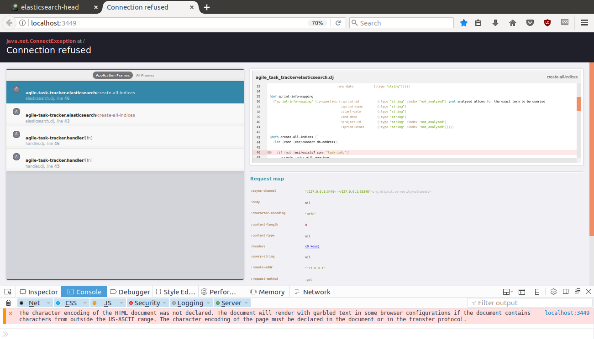

**Image 1 Uber Jar**

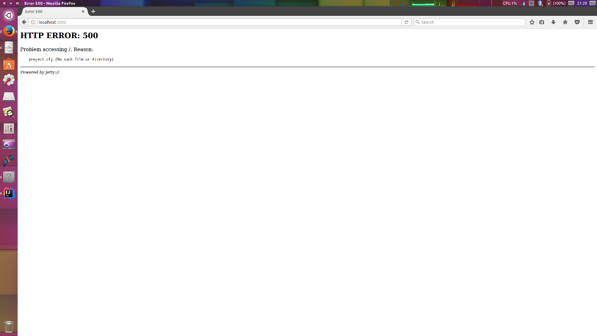

**Image 2**


**Image 3**

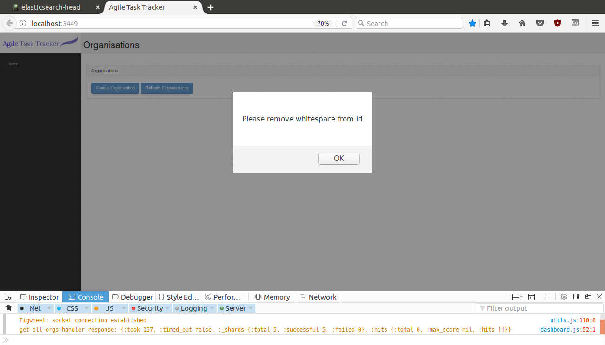

**Image 4**

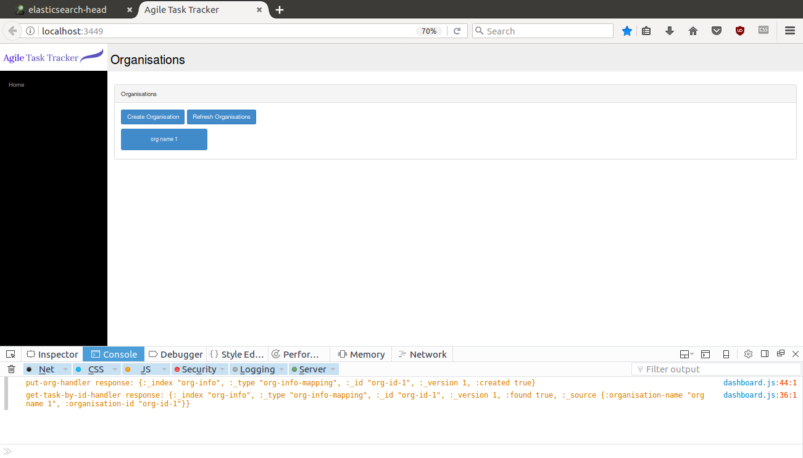

**Image 5**

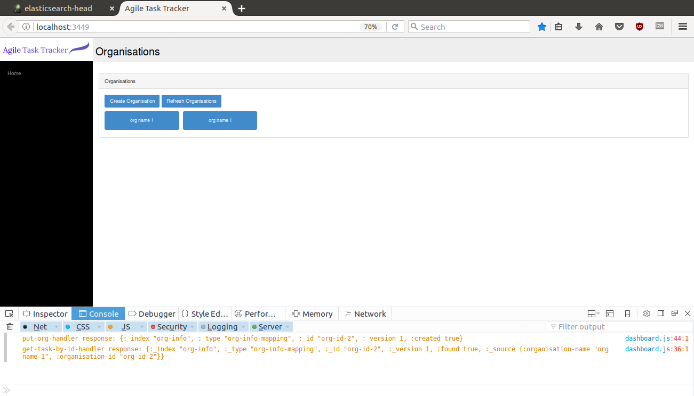

**Image 8**

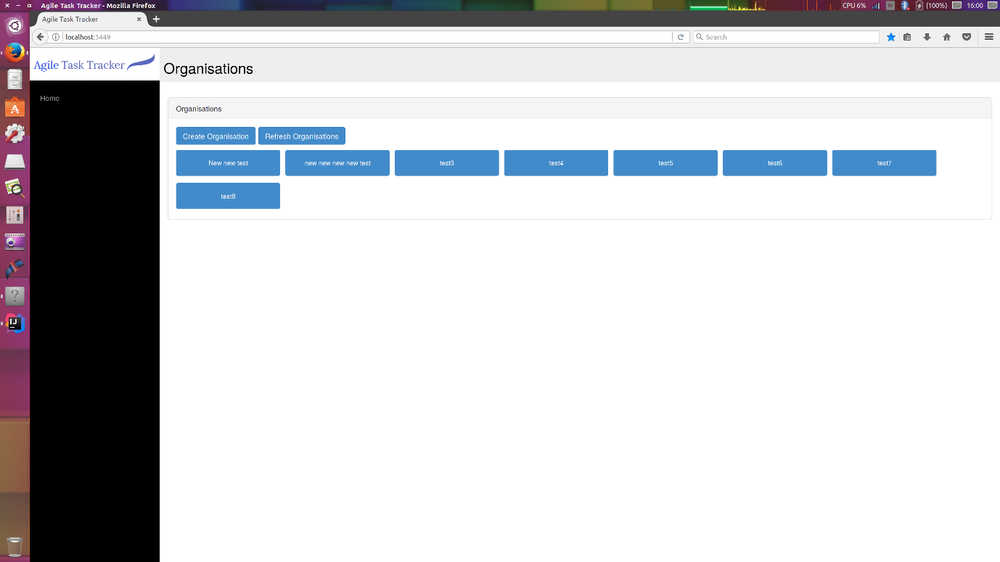

**Image 9**

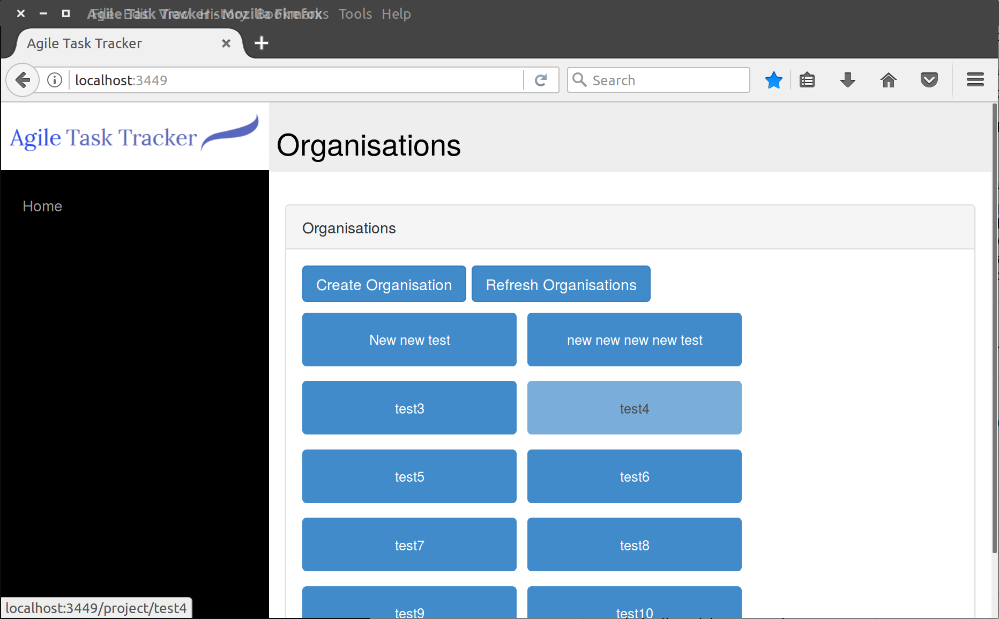

|       |                                                                                                                                                                                    | **Projects Page**                                                                                              |                                                                                                                                                                                                                                                                                                                                                                                                         |   |
|-------|------------------------------------------------------------------------------------------------------------------------------------------------------------------------------------|----------------------------------------------------------------------------------------------------------------|---------------------------------------------------------------------------------------------------------------------------------------------------------------------------------------------------------------------------------------------------------------------------------------------------------------------------------------------------------------------------------------------------------|---|
| \#010 | When making a project, the user doesn't enter either a project id or project name                                                                                                  | Error alert window to enter required fields                                                                    | As intended                                                                                                                                                                                                                                                                                                                                                                                             |   |
|       | When making a project, the user enters a project id with a whitespace in it                                                                                                        | Error alert window to remove whitespace                                                                        | As intended                                                                                                                                                                                                                                                                                                                                                                                             |   |
| \#011 | When creating a project, the user enters a non-date string                                                                                                                         | date accepted                                                                                                  | Need date validation                                                                                                                                                                                                                                                                                                                                                                                    |   |
| \#012 | When creating a project, the user enters a non-number string into the estimated man hours field                                                                                    | Status 400 "Bad request"                                                                                       | Require warning window to alert user to proper data type                                                                                                                                                                                                                                                                                                                                                |   |
| \#013 | When 2 different organisations with two different organisation IDs and names exist on the database and both make a project with the same project id and project name               | 2nd org takes project, removes project from org1 project page                                                  | UUID required for project/org/sprint/task id generation                                                                                                                                                                                                                                                                                                                                                 |   |
| \#014 | When 2 different organisations with two different organisation IDs and names exist on the database and both make a project with the same project id different project names        | Same as \#013. Name overwritten by 2nd project                                                                 | Same as \#013                                                                                                                                                                                                                                                                                                                                                                                           |   |
| \#015 | When 2 different organisations with two different organisation IDs and names exist on the database and both make a project with different project id and the same project names    | Each org and project exist independently and are successfully retrieved                                        | Working as intended                                                                                                                                                                                                                                                                                                                                                                                     |   |
| \#016 | Enough Projects are made to not fit on a single row                                                                                                                                | Projects wrap around to fit on multiple rows                                                                   | Working as intended                                                                                                                                                                                                                                                                                                                                                                                     |   |
| \#017 | Enough Projects are made to not fit on a single screen                                                                                                                             | Window becomes scrollable                                                                                      | Working as intended                                                                                                                                                                                                                                                                                                                                                                                     |   |
|       |                                                                                                                                                                                    | **Backlog Page**                                                                                               |                                                                                                                                                                                                                                                                                                                                                                                                         |   |
| \#018 | Only tasks (if any) associated with that project should be loaded                                                                                                                  | All backlog tasks for all projects are loaded                                                                  | We need to implement the same check that we already have for active sprints. In current sprints, we filter the results to only active sprints that belong to that project-id (which there should only be one of). We need to apply that same filter to backlog                                                                                                                                          |   |
| \#019 | When creating a task, the user doesn’t enter a required field, i.e. task id, task title, created by, estimated time                                                                | For every field an alert is shown asking to fill out required fields as marked                                 | Need to stop modal closing on error                                                                                                                                                                                                                                                                                                                                                                     |   |
| \#020 | When creating a task, the user puts a whitespace in in the task-id                                                                                                                 | Alert shown "Please remove whitespace"                                                                         | Need to change alert string to "ID's must be one word and not contains spaces. Will be solved by ID Generation                                                                                                                                                                                                                                                                                          |   |
| \#021 | When creating a task, the user enters a non-date string into the date field                                                                                                        | Accepts non-date string.                                                                                       | Need date validation                                                                                                                                                                                                                                                                                                                                                                                    |   |
| \#022 | When creating a task, the user uses the same task id as another task within the same project                                                                                       | Accepts. Overwrites Previous task                                                                              | Will be solved by ID Generation                                                                                                                                                                                                                                                                                                                                                                         |   |
| \#023 | When creating a task, the user uses the same task id as a task in a different project                                                                                              | Task removed from previous Project. Now attached to 2nd project                                                | Will be solved by ID Generation                                                                                                                                                                                                                                                                                                                                                                         |   |
| \#024 | When creating a task, the user enters a non-number string into the estimated time field                                                                                            | Status 400 bad request                                                                                         | User alert needs to be includes, check for non-numerical value                                                                                                                                                                                                                                                                                                                                          |   |
| \#025 | When creating a sprint, the user doesn't enter in either a sprint id or sprint name                                                                                                | Alert window Shown asking to fill out required info                                                            | Working as Intended                                                                                                                                                                                                                                                                                                                                                                                     |   |
| \#026 | When creating a sprint, the user puts a whitespace into the sprint id                                                                                                              | Alert window shown asking to remove whitespace                                                                 | Will be solved by ID Generation                                                                                                                                                                                                                                                                                                                                                                         |   |
| \#027 | When the user is creating a sprint, they enter in a non-date string into the start date and/or end date fields                                                                     | String accepted                                                                                                | need date validation                                                                                                                                                                                                                                                                                                                                                                                    |   |
| \#028 | User attempts to make a sprint with no tasks assigned                                                                                                                              | Accepted                                                                                                       | This is valid.                                                                                                                                                                                                                                                                                                                                                                                          |   |
| \#029 | While there is already a sprint active, the user attempts to make a new sprint without ending the old one                                                                          | New sprint is created, both sprints are now active. User must hit end sprint once to get task to reappear      | The saving of a new sprint should ask for confirmation to close a previous sprint                                                                                                                                                                                                                                                                                                                       |   |
| \#030 | The user attempts to add a task to a sprint without inputting the same sprint information                                                                                          | Adds new task to same sprint                                                                                   | As intended. Need to auto fill current sprint info in form for user to see.                                                                                                                                                                                                                                                                                                                             |   |
| \#031 | The user places a task from the backlog column into the sprint creation column. Then they move that task back into the backlog column, then they create a sprint                   | Task not added to new sprint                                                                                   | As intended.                                                                                                                                                                                                                                                                                                                                                                                            |   |
| \#032 | The user places a task from the backlog column into the sprint creation column. Then they delete the task, then they create a sprint                                               | Task no longer assigned to sprint                                                                              | As intended.                                                                                                                                                                                                                                                                                                                                                                                            |   |
|       |                                                                                                                                                                                    | **Current Sprint Page**                                                                                        |                                                                                                                                                                                                                                                                                                                                                                                                         |   |
| \#033 | For a newly created sprint, all tasks should be in the to do column.                                                                                                               | All tasks rendered accordingly                                                                                 | As intended.                                                                                                                                                                                                                                                                                                                                                                                            |   |
| \#034 | For a sprint that is in progress, tasks should be rendered in their respective columns based off their task-state in the database.                                                 | All tasks rendered accordingly                                                                                 | As intended.                                                                                                                                                                                                                                                                                                                                                                                            |   |
|       |                                                                                                                                                                                    | **Side Bar**                                                                                                   |                                                                                                                                                                                                                                                                                                                                                                                                         |   |
| \#035 | On the homepage, only a link to the Home page should be shown                                                                                                                      | Only Home link is shown                                                                                        | As intended. Image \#035                                                                                                                                                                                                                                                                                                                                                                                |   |
| \#036 | On the projects page, only links for Home and projects should be shown. The link to projects only links to projects for that organisation                                          | Only Home and Projects links are shown                                                                         | As intended. Image \#036                                                                                                                                                                                                                                                                                                                                                                                |   |
| \#037 | On the backlog and current sprints pages’ links for Home, Project, Backlog, and Current Sprint should be shown. The links for Backlog and Current Sprint are only for that project | All stated links are shown. Backlog and Current sprint links to the correct backlog and sprint for the project | As intended. Image \#037                                                                                                                                                                                                                                                                                                                                                                                |   |
| \#038 | On either the home page or project page the user refreshes the browser and tries to use the sidebar links that are available for those pages                                       | All sidebar links available to those pages’ work (i.e. the Home and Projects links                             | As intended                                                                                                                                                                                                                                                                                                                                                                                             |   |
| \#039 | On either the backlog page or current sprint page the user refreshes and tries to use the sidebar links that are available for those pages                                         | Only the Home and Project links work. The Backlog and Current Sprints links do not                             | This is due to the fact links to the correct Backlog and Current Sprints pages are generated by appending the project-id which is store in the session to the links. On a refresh the project-id stored in the current session is gone, thus breaking the links. A solution would be to query the database for the relevant project-id if the project-id in the current session is null from a refresh. |   |

**Image 35**

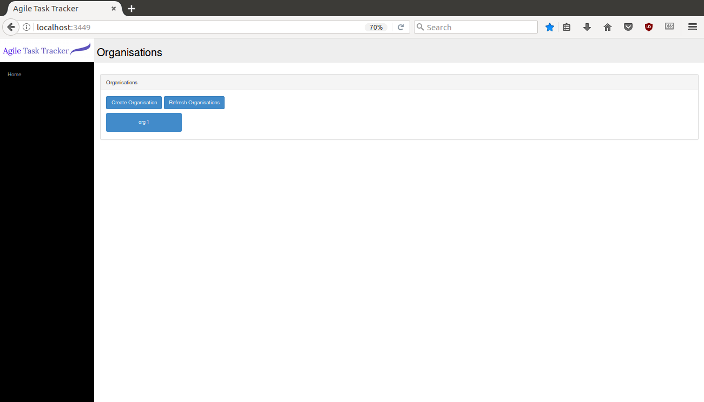

**Image 36**

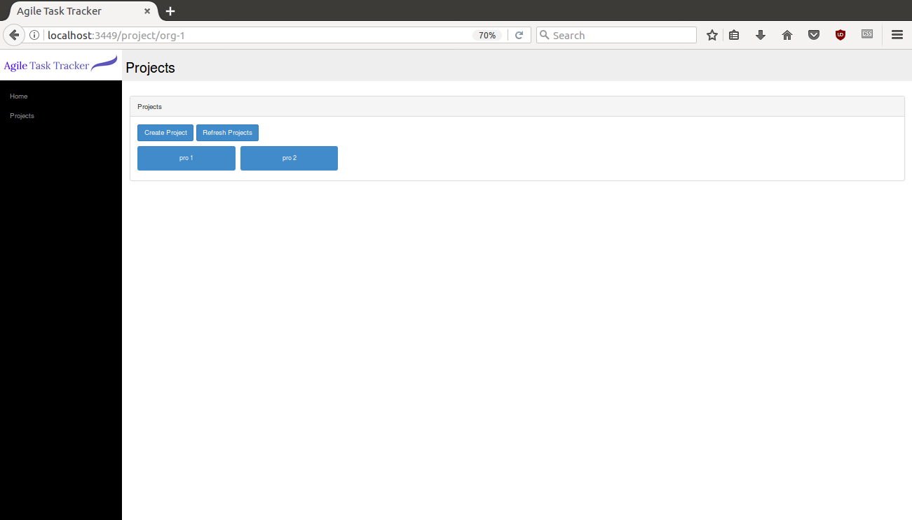

**Image 37**

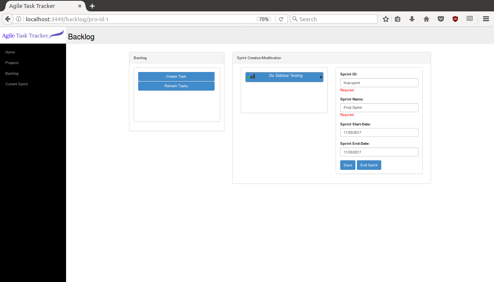

|       |                                                                                                              | **Task Portlet**                                                                                                |                                                                       |   |
|-------|--------------------------------------------------------------------------------------------------------------|-----------------------------------------------------------------------------------------------------------------|-----------------------------------------------------------------------|---|
| \#040 | When the user is editing a task portlet, the user edits a piece of information and hits save                 | The information is edited correctly and saved                                                                   | As intended.                                                          |   |
| \#041 | When a user is editing a task portlet, the user removes a required field and hits save                       | The task is saved without the required field. Note that the task id cannot be edited/ removed by design         | The required fields check must be re-called for the editing of a task |   |
| \#042 | When the user is editing a task portlet, the user edits a piece of information and hits close without saving | The task is not edited                                                                                          | As intended.                                                          |   |
| \#043 | The user hits the delete button on the task portlet from both the backlog page and the current sprint page   | The task is removed correctly from the database and does not appear in either the backlog or the current sprint | As intended.                                                          |   |

**Unit Tests** 
===============
We have written a number of tests written that can be run through leiningen, our build automation and dependency management tool. The tests can be run with the following command

```
lein doo phantom test once
```

Within our code project structure we have a test folder which contains cljs tests for our project. When the above command is entered, leiningen looks within this folder for the file "doo_runner.cljs". This file define which testing files are to be run.

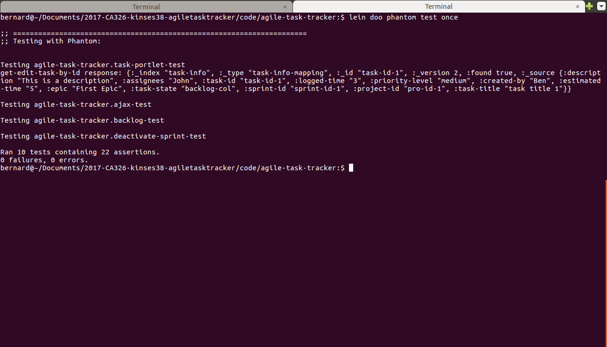

Here we have the output from running our tests. You can see that the tests written for task-portlet.cljs, ajax.cljs, backlog.cljs and deactivate-sprint.cljs, have all completed successfully.

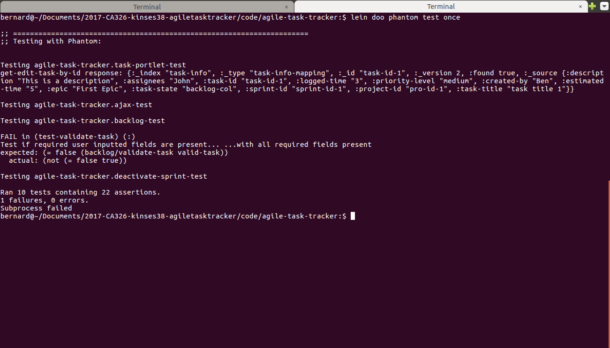

And here you can see the sample output for when I cause one of the tests to fail, which alerts you to how many and which tests failed, and what the expected and actual results of the test were.

**Load times** 
===============

|  Image Ref    | **Optimisations/Load times**                                             |              |
|---------------|--------------------------------------------------------------------------|--------------|
| Devload       | Dev figwheel server, non-cached load                                     | 0.73 seconds |
| Uberload      | Uberjar production version, non-cached load, css/bootstrap/jQuery online | 0.49 seconds |
| UberLocalLoad | Uberjar production, bootstrap/jQuery/css saved locally                   | 0.43 seconds |

**DevLoad**

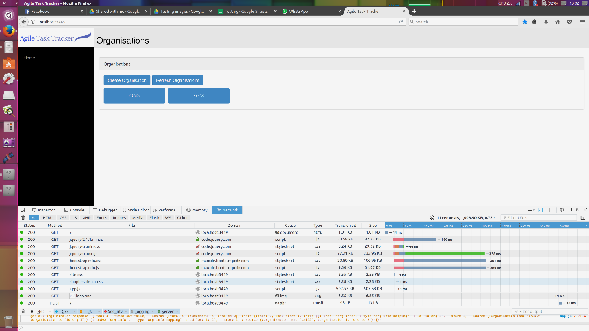

**Uberload**

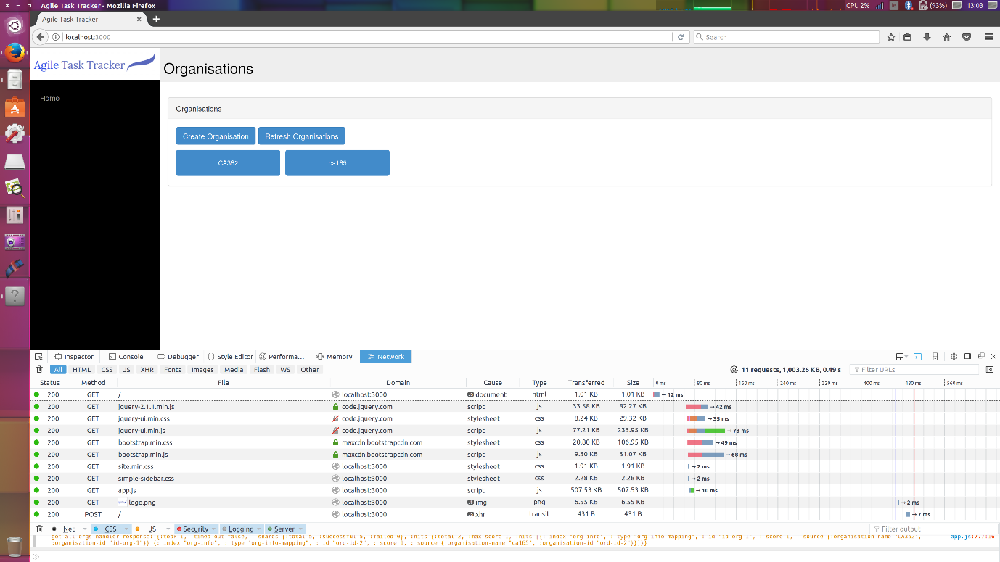

**UberLocalLoad**

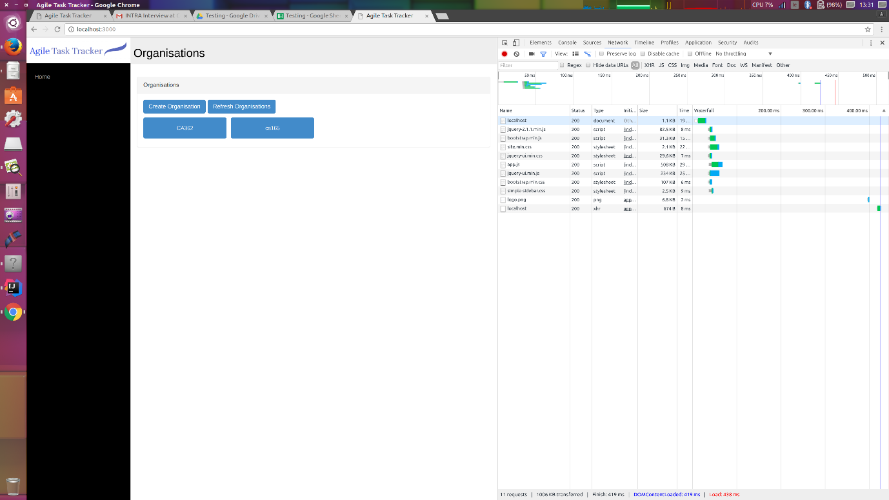

**User Testing**
================

|                                                                                           |   |                     | **User Testing**         |                                                             |
|-------------------------------------------------------------------------------------------|---|---------------------|--------------------------|-------------------------------------------------------------|
| **Task**                                                                                  |   | **Expected time**   | **Average (Rounded up)** | **Comments**                                                |
| Create new org                                                                            |   | 10 seconds          | 11 seconds               | Entered ID with space. Pressed enter to submit              |
| Navigate to project page, Create new project                                              |   | 20 seconds          | 19 seconds               | Entered dates by typing                                     |
| Navigate to backlog, create new task. Task specific Info given                            |   | 30\>40 seconds.     | 45 seconds               | Created task without estimating time. Required field noted. |
| Add tasks to sprint creation, start new sprint                                            |   | 40 seconds          | 38 seconds               | Started sprint before adding all tasks.                     |
| Navigate to Current Sprint, move tasks to in progress, edit task to assign person to task |   | 20 seconds          | 21 seconds               | Mistype on assignee.                                        |
| Update logged time on singular task, add to completed. Then end sprint                    |   | 50 seconds \> 1 min | 49 seconds               | Success without comment                                     |
